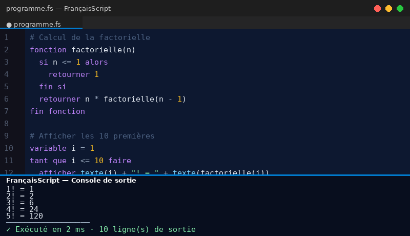

# FrançaisScript 🇫🇷

**Le premier langage de programmation entièrement en français — support officiel pour VS Code.**



---

## ✨ Fonctionnalités

| Fonctionnalité | Description |
|---|---|
| **Coloration syntaxique** | Mots-clés, chaînes, nombres, fonctions — tout est coloré |
| **Exécution directe** | `Ctrl+Entrée` pour lancer le programme sans quitter VS Code |
| **Autocomplétion** | Suggestions intelligentes des mots-clés et fonctions intégrées |
| **Documentation au survol** | Passez la souris sur un mot-clé pour voir sa description |
| **Snippets** | Générez des structures complètes en tapant un court préfixe |
| **Indentation auto** | Les blocs `si`, `tant que`, `fonction` s'indentent automatiquement |
| **Barre de statut** | Bouton ▶ toujours visible en bas de VS Code |

---

## Démarrage rapide

1. Créez un fichier `bonjour.fs`
2. Écrivez votre programme
3. Appuyez sur **`Ctrl+Entrée`** (`⌘+Entrée` sur Mac)

```
# Mon premier programme FrançaisScript
variable prenom = "Alice"
variable age = 25

si age >= 18 alors
  afficher prenom + " est majeure !"
sinon
  afficher prenom + " est mineure."
fin si
```

La sortie s'affiche instantanément dans le panneau **FrançaisScript** en bas de VS Code.

---

## Syntaxe complète

### Variables

```
variable nom    = "Alice"
variable age    = 25
variable actif  = vrai
liste   fruits  = ["pomme", "banane", "cerise"]
```

### Conditions

```
si age >= 18 alors
  afficher "Majeur"
sinon si age >= 13 alors
  afficher "Adolescent"
sinon
  afficher "Enfant"
fin si
```

### Boucles

```
# Boucle conditionnelle
tant que i < 10 faire
  afficher texte(i)
  variable i = i + 1
fin tant que

# Boucle N fois
répéter 5 fois
  afficher "Bonjour !"
fin répéter
```

### Fonctions

```
fonction factorielle(n)
  si n <= 1 alors
    retourner 1
  fin si
  retourner n * factorielle(n - 1)
fin fonction

afficher texte(factorielle(10))   # 3628800
```

### Listes

```
liste nombres = [10, 20, 30]
ajouter 40 à nombres

afficher longueur(nombres)   # 4
afficher nombres[0]          # 10
```

---

## Snippets disponibles

Tapez le préfixe puis **`Tab`** pour insérer automatiquement :

| Préfixe | Ce qui est généré |
|---|---|
| `var` | `variable nom = valeur` |
| `si` | Bloc `si / fin si` |
| `sisi` | Bloc `si / sinon / fin si` |
| `sisisi` | Bloc `si / sinon si / sinon / fin si` |
| `tq` | Boucle `tant que` |
| `rep` | Boucle `répéter N fois` |
| `pour` | Boucle avec compteur (équivalent de `for`) |
| `fn` | Définition de fonction avec retour |
| `fns` | Définition de fonction sans retour |
| `parc` | Parcourir tous les éléments d'une liste |
| `affv` | Afficher un label + une variable |
| `prog` | Programme complet avec en-tête |
| `fizzbuzz` | FizzBuzz classique prêt à l'emploi |

---

##  Fonctions intégrées

### Mathématiques

| Fonction | Description | Exemple |
|---|---|---|
| `hasard(min, max)` | Entier aléatoire | `hasard(1, 6)` → `4` |
| `arrondi(n)` | Arrondi | `arrondi(3.7)` → `4` |
| `plancher(n)` | Arrondir vers le bas | `plancher(3.9)` → `3` |
| `plafond(n)` | Arrondir vers le haut | `plafond(3.1)` → `4` |
| `absolu(n)` | Valeur absolue | `absolu(-5)` → `5` |
| `racine(n)` | Racine carrée | `racine(16)` → `4` |

### Texte & Conversion

| Fonction | Description | Exemple |
|---|---|---|
| `texte(val)` | Convertit en texte | `texte(42)` → `"42"` |
| `nombre(val)` | Convertit en nombre | `nombre("3.14")` → `3.14` |
| `longueur(val)` | Taille d'un texte ou liste | `longueur("Bonjour")` → `7` |
| `majuscules(t)` | Majuscules | `majuscules("hello")` → `"HELLO"` |
| `minuscules(t)` | Minuscules | `minuscules("WORLD")` → `"world"` |
| `inverser(val)` | Inverse un texte ou liste | `inverser("abc")` → `"cba"` |
| `contient(val, s)` | Cherche dans un texte/liste | `contient("bonjour", "bon")` → `vrai` |

---

## Raccourcis clavier

| Raccourci | Action |
|---|---|
| `Ctrl+Entrée` | Exécuter le programme |
| `⌘+Entrée` (Mac) | Exécuter le programme |
| `Ctrl+Espace` | Ouvrir l'autocomplétion |
| `Tab` | Insérer un snippet |

---

##  À propos de FrançaisScript

FrançaisScript est un langage de programmation interprété dont la syntaxe est entièrement en français. Il est conçu pour :

- **L'enseignement** — apprendre les bases de la programmation sans barrière linguistique
- **Les débutants** — un code qui se lit comme du texte français naturel
- **Les francophones** — programmer dans sa langue maternelle

Site officiel : [francaisscript](https://frsscript.netlify.app/)

---

## Licence

MIT — © 2026 FrançaisScript
